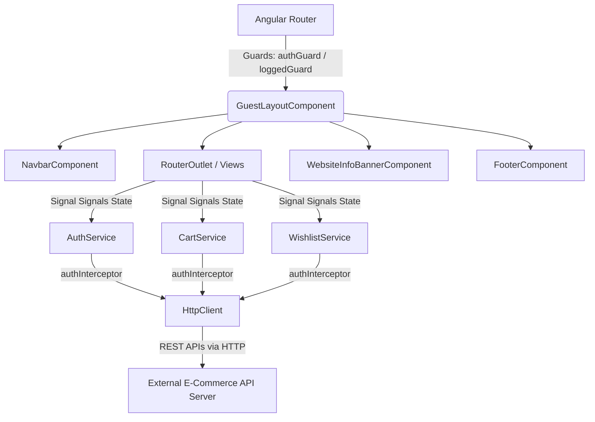
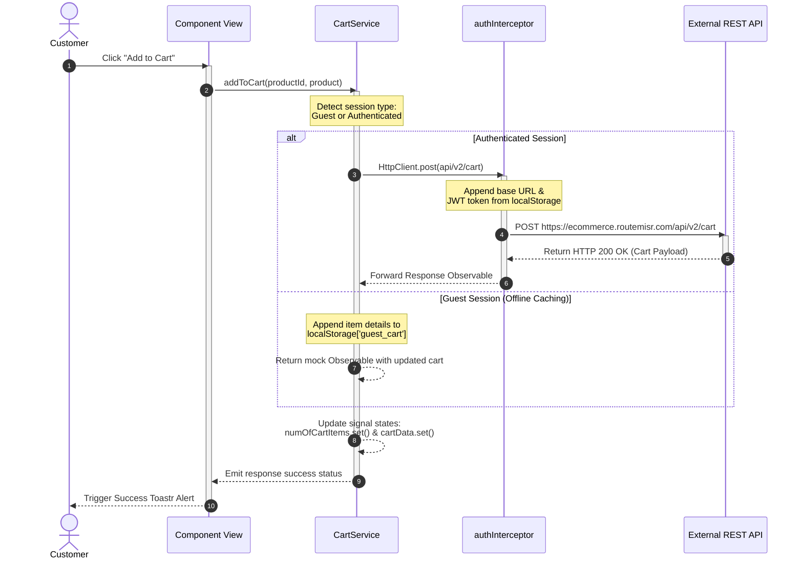

# FreshCart - Standalone Angular 21 E-Commerce Platform

FreshCart is a premium, high-performance, and fully responsive e-commerce web application built on **Angular 21** using modern **Angular Signals** for local and global state management and **Tailwind CSS v4** combined with **Flowbite** for design aesthetics. The client application integrates with an external RESTful API to deliver a rich shopping experience. It features server-side rendering (SSR), offline-to-online shopping cart synchronization, JWT-based security with automated route protections, dynamic product category filtering, wishlist caching, and integrated checkout operations supporting cash payments and Stripe-based online payments.

---

## 📖 Table of Contents
1. [Project Overview](#-project-overview)
2. [Key Features](#-key-features)
3. [System Architecture](#-system-architecture)
4. [Technical Architecture](#-technical-architecture)
5. [Tech Stack](#-tech-stack)
6. [Database Design](#-database-design)
7. [Authentication & Authorization](#-authentication--authorization)
8. [Design Patterns Used](#-design-patterns-used)
9. [API Documentation](#-api-documentation)
10. [Folder Structure](#-folder-structure)
11. [Data Flow](#-data-flow)
12. [Configuration](#-configuration)
13. [Installation Guide](#-installation-guide)
14. [Docker Deployment](#-docker-deployment)
15. [Security Features](#-security-features)
16. [Performance Optimizations](#-performance-optimizations)
17. [Error Handling](#-error-handling)
18. [Future Enhancements](#-future-enhancements)
19. [Project Highlights](#-project-highlights)

---

## 🌟 Project Overview

### What the System Does
FreshCart provides retail consumers with a fast, organic, and modern shopping layout where they can explore products, organize carts, save wishlists, manage profile details, and place secure cash or card orders. The application utilizes a hybrid client-caching mechanism to minimize API calls and keep client-server state seamlessly aligned.

### Problem It Solves
Traditional e-commerce architectures often force users to sign in before compiling a shopping cart, creating a barrier to entry. FreshCart bridges this gap by allowing guest users to build cart sessions locally. Upon registration or login, local guest cart items are synchronized automatically to the user's account on the backend database without losing their shopping context.

### Business Value
* **Conversion Optimization**: Minimizes drop-offs via frictionless checkout flows and a unified guest shopping experience.
* **Responsive Visuals**: Leverages premium layout styles (Swiper sliders, product grids, custom loading spinners) that appeal to modern consumers.
* **High Core Web Vitals**: Utilizes Angular SSR and hydration to decrease Time to Interactive (TTI) and First Contentful Paint (FCP).

### Target Users
Daily retail consumers looking for an intuitive, fast, and secure digital storefront to shop for general consumer products.

---

## ✨ Key Features

### 🛒 Shopping Cart & Guest Flow
* **Offline-First Guest Cart**: Guests can browse catalogs and append items directly to a cart cached in local storage.
* **Automatic Synchronization**: The moment a guest logs in, the [CartService] triggers `syncGuestCart()`, streaming local items sequentially to the user's remote profile.
* **Subtotal Recalculations**: Real-time quantity increments/decrements with dynamic signal-driven subtotal calculation.
* **Coupon Codes**: Native checkouts can invoke coupon codes to fetch and apply discounts.

### 🔒 Security & Route Protections
* **Navigation Guards**: Implements [authGuard] to intercept unauthenticated attempts to access profile panels, wishlist summaries, or payment checkouts, forwarding them to `/login` with target query redirects.
* **Authentication Safeguards**: Implements [loggedGuard] to prevent authenticated users from navigating back to sign-in or registration paths.
* **JWT Expiry & Decodes**: Parses user identities directly from JWT headers using `jwt-decode` on the client side, storing user contexts reactively.

### 📦 Search & Browse Catalog
* **Dynamic Search Filtering**: Client-side query matching against titles, categories, and brand tags.
* **Slider Sliders**: Integrates Swiper Elements carousel sliders in the hero section and category lists, avoiding page layout shifts.
* **Wishlist Preservations**: Active tracking of liked items via Set-based signal flags (`wishlistIds`), letting users toggle products dynamically.

### 💳 Checkout & Order Tracking
* **Stripe Checkout Integration**: Online card checkout redirects to Stripe sessions, sending redirect return pointers to the client.
* **Cash on Delivery**: Cashed payment options directly submitting shipping payloads to local endpoints.
* **Order History**: Unified history page summarizing previous invoice details, purchase dates, item counts, and statuses.

---

## 📐 System Architecture

### Architectural Style
The client application is organized using a **Standalone Component Architecture** based on Angular 21, structured with core, feature, and shared boundaries. Communication with the backend relies on an external RESTful API service. 



### Layer Responsibilities
* **Layout Layer**: The [GuestLayoutComponent] coordinates global UI layout structures (navigation bars, footers, info boards, router outlets).
* **Feature Layer**: Standardized modular subdirectories enclosing target pages, component view models, endpoints, and services (e.g., `auth`, `products`, `cart`, `wishlist`, `checkout`).
* **Core Layer**: House rules, constants, interceptors, global layout models, and guards.
* **Shared Layer**: Reusable dummy UI components (e.g., spinners, headers, breadcrumbs).

---

## 💻 Technical Architecture

```
                                  ┌──────────────────────────┐
                                  │    Presentation Layer    │
                                  │ (Components/Views/CSS)   │
                                  └────────────┬─────────────┘
                                               │
                                               ▼
                                  ┌──────────────────────────┐
                                  │    Application Layer     │
                                  │ (Feature-Scoped Services)│
                                  └────────────┬─────────────┘
                                               │
                                               ▼
                                  ┌──────────────────────────┐
                                  │     Infrastructure       │
                                  │  (authInterceptor/HTTP)  │
                                  └────────────┬─────────────┘
                                               │
                                               ▼
                                  ┌──────────────────────────┐
                                  │    External REST API     │
                                  │  (ecommerce.routemisr)   │
                                  └──────────────────────────┘
```

1. **Core Layer**: Manages central cross-cutting configurations, such as [authInterceptor], which dynamically injects headers and base URLs on relative HTTP streams.
2. **Application Layer**: Contains logic managed in services (such as [AuthService] and [CartService]) using RxJS and signals.
3. **Infrastructure Layer**: Incorporates [baseHttp] and standard platform handlers (`PLATFORM_ID`) to bridge interactions between the DOM environment and the application context during hydration.
4. **Presentation Layer**: Implements standalone components binding Angular template files (`*.html`), component stylesheets (`*.css`), and component TypeScript classes to present content.

---

## 🛠️ Tech Stack

| Technology | Purpose | Exact Version |
|------------|---------|---------------|
| **Angular** | Core Client Application Framework | `^21.1.0` (Core, Common, Router), `^21.2.12` (Animations) |
| **Angular SSR** | Server-Side Rendering support for node runtimes | `^21.1.2` |
| **TypeScript** | Strongly typed scripting compiler language | `~5.9.2` |
| **Tailwind CSS** | Premium utility-first styling system | `^4.1.12` |
| **Express** | Local server handler managing SSR distributions | `^5.1.0` |
| **Flowbite** | Custom pre-styled UI component configurations | `^4.0.1` |
| **Flowbite Angular** | Native Angular wrappers for Flowbite | `^21.0.0` |
| **Swiper** | Touch-friendly hero/category carousels | `^12.1.4` |
| **jwt-decode** | Decoding client JWT token payload | `^4.0.0` |
| **ngx-toastr** | Client notifications & toaster alerts | `^20.0.5` |
| **ngx-pagination** | Client-side pagination layout controllers | `^6.0.3` |
| **@rxweb/reactive-form-validators** | Advanced conditional form validation rules | `^13.0.1` |
| **RxJS** | Reactive Extensions managing data streams | `~7.8.0` |

---

## 📊 Database Design

As a client web application, FreshCart does not directly manage a physical SQL/NoSQL database. However, the application uses local storage and models a complete entity relationship architecture based on the schemas returned by the external REST API:

### Main Client Entities
1. **User (`IUser`)**: Holds profile IDs, names, emails, and role credentials decoded from JWT tokens.
2. **Product (`IProduct`)**: Catalog item listing including IDs, titles, slugs, prices, ratings average, and image covers.
3. **Category (`ICategory`)**: Product category containing name, slug, and thumbnail image URL.
4. **Brand (`IBrand`)**: Product manufacturer brand properties.
5. **Cart (`ICart`)**: Contains cart IDs, owners, totals, and cart items.
6. **CartItem (`ICartItem`)**: Association entity bridging Product and Cart, recording product details, pricing, and counts.
7. **Order (`IOrder`)**: Checkout order recording shipping addresses, totals, statuses (paid, delivered), and transaction modes (Cash, Stripe).

### Entity Relationship Diagram (ERD)

```mermaid
erDiagram
    USER ||--o[1] CART : owns
    USER ||--o[*] ORDER : places
    CART ||--o[*] CART-ITEM : contains
    CART-ITEM }|--|| PRODUCT : reference
    PRODUCT }|--|| CATEGORY : categorizes
    PRODUCT }|--|| BRAND : manufactures
    ORDER ||--o[*] CART-ITEM : documents
    ORDER ||--|| ADDRESS : ships-to
```

---

## 🔐 Authentication & Authorization

FreshCart implements a robust authentication and authorization architecture:

### Authentication Workflow
1. **Credentials Submission**: The user enters their email and password. The system applies validator rules via the login form.
2. **REST API Exchange**: The credential details are submitted to `api/v1/auth/signin`.
3. **Token Capture & Decryption**: The returned token string is saved in `localStorage` under the name `token`. The [AuthService] decodes the payload parameters using `jwtDecode`, extracting the user's id, email, and privileges. The user ID is saved in local storage under `userId` to enable personalized request filters.
4. **Reactive Session Signaling**: An Angular computed property (`currentUser`) updates automatically when the token changes, notifying components and layouts of active session changes.

### Guards & Authorization
* **Route Interception**: Protected endpoints evaluate route access via [authGuard]. If the token is missing, the guard blocks routing and redirects the user to the login screen, preserving the requested route as a redirect URL parameter.
* **Authentication Safeguards**: The [loggedGuard] blocks authenticated users from accessing login and registration pages, redirecting them to the home page (`/`).

---

## 🎨 Design Patterns Used

### 1. Service-Repository Pattern
* **Concept**: Encapsulates external API communication within centralized services to prevent page controllers from directly invoking HTTP requests.
* **Location**: Found in feature-scoped services like [ProductsService] and [BrandsService].
* **Benefit**: Ensures high testability, separation of concerns, and clean maintenance.

### 2. Dependency Injection (DI)
* **Concept**: Uses Angular's native dependency injection container to manage service singletons.
* **Location**: Configured via `@Injectable({ providedIn: 'root' })` across services, utilizing constructor injections or modern `inject()` definitions.
* **Benefit**: Avoids hard-coded constructor instantiations and enables mocking during testing.

### 3. Interceptor Pattern
* **Concept**: Intercepts outgoing HTTP requests globally to attach common parameters and headers.
* **Location**: Implemented in [authInterceptor].
* **Benefit**: Dynamically prepends target API base URLs and appends authentication headers, keeping individual services clean.

### 4. Reactive State Pattern (Signals)
* **Concept**: Uses fine-grained reactive primitives to manage application state changes without relying on zone-based change detection cycles.
* **Location**: Used in [CartService] (`numOfCartItems`, `cartData`) and [WishlistService] (`wishlistIds`).
* **Benefit**: Optimizes UI render performance, tracking page mutations and re-rendering only affected DOM nodes.

---

## 🔌 API Documentation

All request URLs are prefixed dynamically by [authInterceptor] using the target configured endpoint (`https://ecommerce.routemisr.com`).

### Authentication & Users
| Method | Route | Description | Auth Required |
|:------:|-------|-------------|:-------------:|
| `POST` | `api/v1/auth/signup` | Register a new customer account | No |
| `POST` | `api/v1/auth/signin` | Sign in with email/password to retrieve JWT | No |
| `POST` | `api/v1/auth/forgotPasswords` | Email code verification request for password resets | No |
| `POST` | `api/v1/auth/verifyResetCode` | Verify the password reset code received by email | No |
| `PUT` | `api/v1/auth/resetPassword` | Apply new account password parameters | No |
| `PUT` | `api/v1/users/changeMyPassword` | Change the logged-in user's password | Yes |

### Products & Catalog
| Method | Route | Description | Auth Required |
|:------:|-------|-------------|:-------------:|
| `GET` | `api/v1/products` | Retrieve all catalog items (supports pagination and filters) | No |
| `GET` | `api/v1/products/{id}`| Retrieve specific product details | No |
| `GET` | `api/v1/categories` | Retrieve all categories | No |
| `GET` | `api/v1/categories/{id}`| Retrieve category details | No |
| `GET` | `api/v1/brands` | Retrieve all brand list definitions | No |
| `GET` | `api/v1/brands/{id}` | Retrieve brand profile data | No |

### Shopping Cart
| Method | Route | Description | Auth Required |
|:------:|-------|-------------|:-------------:|
| `GET` | `api/v2/cart` | Retrieve user cart items | Yes |
| `POST` | `api/v2/cart` | Append new product entry to user's cart | Yes |
| `PUT` | `api/v2/cart/{productId}`| Update product count in cart | Yes |
| `DELETE`| `api/v2/cart/{productId}`| Delete product entry from cart | Yes |
| `DELETE`| `api/v2/cart` | Clear user cart items | Yes |
| `PUT` | `api/v2/cart/applyCoupon`| Apply coupon discount code | Yes |

### Wishlist
| Method | Route | Description | Auth Required |
|:------:|-------|-------------|:-------------:|
| `GET` | `api/v1/wishlist` | Retrieve saved products | Yes |
| `POST` | `api/v1/wishlist` | Save a product to user wishlist | Yes |
| `DELETE`| `api/v1/wishlist/{productId}`| Remove product from user wishlist | Yes |

### Checkout & Orders
| Method | Route | Description | Auth Required |
|:------:|-------|-------------|:-------------:|
| `POST` | `api/v2/orders/{cartId}`| Complete order checkout using Cash on Delivery | Yes |
| `POST` | `api/v1/orders/checkout-session/{cartId}?url={appUrl}`| Initialize Stripe online card checkout session | Yes |
| `GET` | `api/v1/orders/user/{userId}`| Retrieve user's completed order list history | Yes |

---

## 📁 Folder Structure

The directory tree below illustrates the organization of the codebase:

```
E-commerce/
├── .angular/                  # Angular caching directories
├── .vscode/                   # Development environment workspace settings
├── public/                    # Static public assets (images, logos)
├── src/
│   ├── app/
│   │   ├── core/              # Centralized layouts, guards, interceptors, constants
│   │   │   ├── components/    # Common layouts elements (navbar, footer)
│   │   │   ├── constants/     # API path definitions (app-apis) and storage keys
│   │   │   ├── guards/        # Routing authorization filters (authGuard, loggedGuard)
│   │   │   ├── helpers/       # Helper scripts
│   │   │   ├── interceptors/  # Dynamic header/URL modifiers (authInterceptor)
│   │   │   ├── interfaces/    # Central configuration interfaces
│   │   │   ├── layouts/       # Main guest wrapper layouts (GuestLayoutComponent)
│   │   │   ├── resolvers/     # Pre-route data loaders
│   │   │   └── services/      # Base HTTP singletons (baseHttp service)
│   │   ├── features/          # Feature domains containing pages and services
│   │   │   ├── auth/          # Login, Register, Forgot Password flows
│   │   │   ├── brands/        # Brand browse routes
│   │   │   ├── cart/          # Cart lists, guest modes, state mergers
│   │   │   ├── categories/    # Product categories browse routes
│   │   │   ├── checkout/      # Stripe online sessions & Cash checkouts
│   │   │   ├── home/          # Hero carousels, marketing banners, featured grids
│   │   │   ├── products/      # Catalog searches, item specifications, details
│   │   │   ├── static/        # Static pages (profile details, 404 sheets)
│   │   │   └── wishlist/      # User wishlist management
│   │   └── shared/            # Shared UI components (spinners, breadcrumbs)
│   │       └── components/
│   │           ├── bread-crumbs/
│   │           ├── loading-data-spinner/
│   │           ├── page-header/
│   │           ├── product-card/
│   │           └── website-info-banner/
│   ├── environments/          # Application environment variables (dev/prod)
│   ├── styles/                # Tailwind v4 utility theme styling
│   │   ├── base.css
│   │   ├── button.css
│   │   ├── theme.css
│   │   ├── toaster.css
│   │   └── typography.css
│   ├── app.config.server.ts   # Angular Server configuration options
│   ├── app.config.ts          # Core Client configuration options
│   ├── app.routes.server.ts   # Server-side routing rules
│   ├── app.routes.ts          # Client-side routing declarations
│   ├── app.ts                 # Main component bootstrapping
│   ├── main.server.ts         # Angular SSR bootstrap entry point
│   ├── main.ts                # Main browser bootstrapping entry point
│   └── server.ts              # SSR Express application server
├── angular.json               # Angular CLI compilation configurations
├── package.json               # Package manifests and dependency trees
├── tsconfig.json              # TypeScript compilation rules
└── tsconfig.app.json          # App-specific TypeScript compiler guidelines
```

---

## 🔄 Data Flow

When a user interacts with the application, data flows through the layers as shown in the sequence diagram below. This example illustrates adding a product to the shopping cart:



---

## ⚙️ Configuration

FreshCart uses environment configuration files located in `src/environments/`:

### Environment Configurations (`environment.ts` / `environment.development.ts`)
```typescript
export const environment = {
  production: true, // Set to false in environment.development.ts
  baseUrl: 'https://ecommerce.routemisr.com', // Base URL of external API
  appUrl: 'http://localhost:4200/' // Base URL of client application for payment redirects
};
```

### Application Config Providers (`app.config.ts`)
Standard configurations are managed programmatically:
```typescript
export const appConfig: ApplicationConfig = {
  providers: [
    provideBrowserGlobalErrorListeners(), // Global browser error logging
    provideRouter(routes),                // Routes mapping configuration
    provideClientHydration(withEventReplay()), // SSR client-side hydration
    provideHttpClient(withFetch(), withInterceptors([authInterceptor])), // HTTP client config
    provideAnimations(),                 // Enable UI animations
    provideToastr({                      // Toastr notification alerts
      timeOut: 3000,
      positionClass: 'toast-top-right',
      preventDuplicates: true,
    }),
  ],
};
```

### Key Storage Indicators (`localStorage`)
* `token`: The active JWT string retrieved upon login.
* `userId`: The active user ID decoded from the JWT payload. Used to fetch past orders.
* `guest_cart`: Cached JSON array of items added by guest users.

---

## 🚀 Installation Guide

### Prerequisites
* **Node.js**: Version 18.x or 20.x or newer
* **npm**: Version 9.x or newer

### Installation Steps
1. **Clone the Repository**:
   ```bash
   git clone <repository-url>
   cd E-commerce
   ```
2. **Install Dependencies**:
   ```bash
   npm install
   ```
3. **Run the Development Server**:
   ```bash
   npm run start
   ```
   *The application will launch locally at `http://localhost:4200/`.*

4. **Verify Application Hydration & SSR Local Build**:
   ```bash
   npm run build
   node dist/E-commerce/server/server.mjs
   ```
   *This starts the local SSR Express server listening at `http://localhost:4000/`.*

---

## 🐳 Docker Deployment

The application is a pure client-side SPA with SSR support and does not include a Docker configuration by default. To deploy the application in a containerized environment (such as Kubernetes or AWS ECS), you can add the following multi-stage `Dockerfile` to the root of the workspace:

```dockerfile
# Stage 1: Build the Angular App
FROM node:20-alpine AS build
WORKDIR /app
COPY package*.json ./
RUN npm ci
COPY . .
RUN npm run build

# Stage 2: Serve the SSR Distribution via Node/Express
FROM node:20-alpine AS run
WORKDIR /app
COPY --from=build /app/dist/E-commerce ./dist/E-commerce
ENV PORT=4000
EXPOSE 4000
CMD ["node", "dist/E-commerce/server/server.mjs"]
```

---

## 🔒 Security Features

1. **Client JWT Storage**: Access tokens are stored in `localStorage` and attached only to requests targeting matching API domains, preventing token leakage.
2. **Route Authorization Guarding**: Prevents unauthorized page access. If a user is not authenticated, the app denies access to protected routes and redirects them to the login page.
3. **Cross-Site Scripting (XSS) Prevention**: Angular's template engine automatically encodes dynamic values in HTML templates, preventing script injection.
4. **Platform SSR Hydration Guarding**: Protects against server-side rendering errors during server execution. The application wraps all direct storage interactions in platform-checking guards (`isPlatformBrowser`) to prevent reference errors on Node runtimes.

---

## ⚡ Performance Optimizations

* **Server-Side Rendering (SSR)**: Implemented using Express in `src/server.ts` to prerender pages on the server, improving loading performance and Search Engine Optimization (SEO).
* **Client Hydration with Event Replay**: Uses `provideClientHydration(withEventReplay())` to restore application state smoothly without rendering flickers.
* **Angular Signals**: Provides fine-grained updates to specific component properties instead of triggering global layout re-renders.
* **Asynchronous Lazy Routing**: Routes and component assets are loaded on demand during navigation transitions, reducing initial bundle sizes.
* **Hybrid Cart Caching**: Saves guest carts locally to minimize backend server requests and network traffic.

---

## 🛡️ Error Handling

* **Global Error Catching**: Implemented via `provideBrowserGlobalErrorListeners()` in [app.config.ts], catching uncaught exceptions and preventing application crashes.
* **Toastr Visual Alerts**: Captures backend error messages via RxJS response streams and displays them as toast notifications.
* **Safety Boundaries**: Protects against application crashes from malformed tokens by wrapping JWT decoding steps in try-catch statements.

---

## 🔮 Future Enhancements

* **Direct Stripe Card Elements**: Integrate payment inputs directly into the checkout form instead of redirecting the user to Stripe.
* **Native Reviews Submission Form**: Add a reviews form on detail pages to let users submit product ratings directly.
* **OAuth Social Logins**: Support one-click logins using Google or Facebook credentials.
* **Developer Admin Portal**: Create a dashboard route for administration tasks such as updating inventories, managing brands, and tracking active orders.
* **Global Translations (i18n)**: Implement Angular localization to support multiple languages (such as English and Arabic layouts).

---

## 🏆 Project Highlights

* **Architecture**: Standardized Standalone component layout using modern Angular 21 structures, completely removing the complexity of NgModule declarations.
* **State Management**: Built-in state management using Angular Signals and RxJS, keeping components light and updates fast.
* **Seamless User Experience**: Implements offline-to-online guest cart syncing, allowing users to browse as guests and checkout easily after logging in.
* **Optimized Rendering**: Clean hydration configurations and native SSR support for optimal Core Web Vitals performance.
